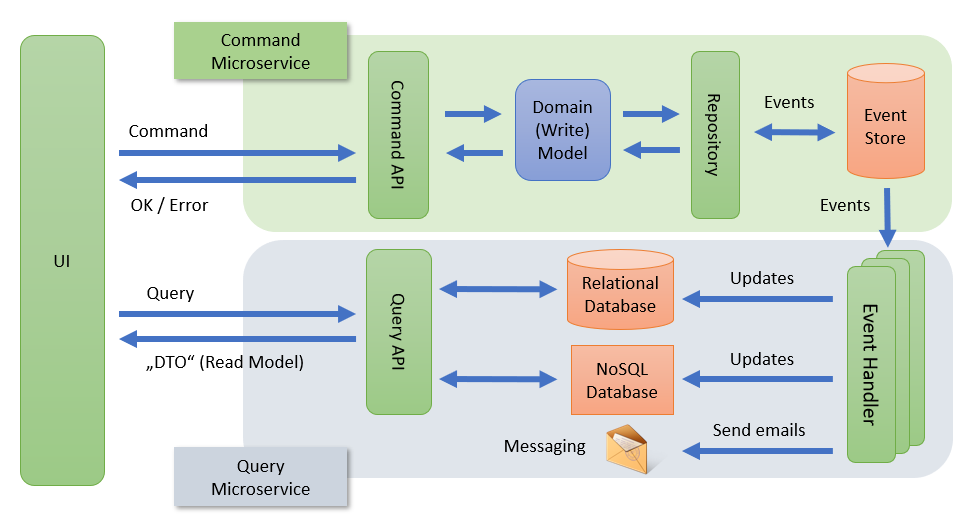
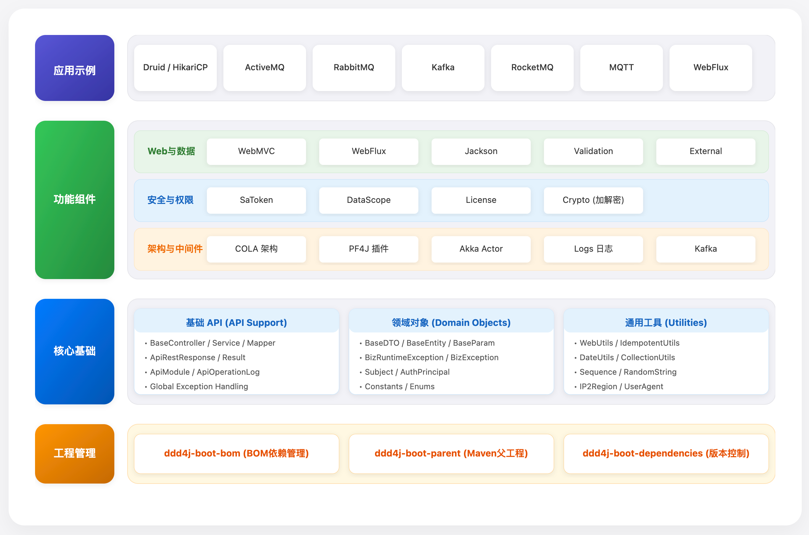

## Ddd4j Boot 3.x 简介

**Ddd4j Boot** 是一个基于 **领域驱动设计（DDD）** 思想的 Java 微服务开发脚手架。采用 Spring Boot 3.5.x
构建，使用轻量级 [ddd-4-java](https://github.com/fuinorg/ddd-4-java)
和 [cqrs-4-java](https://github.com/fuinorg/cqrs-4-java) 库实现领域驱动设计、命令查询职责分离（CQRS）和事件溯源（Event
Sourcing）。

本项目遵循 **Eric Evans** 和 **Vaughn Vernon** 的 DDD 经典理论，不依赖特殊框架，仅使用标准的 JEE/Spring
规范，帮助开发者构建可维护、可扩展的复杂业务系统。

### 🎯 核心设计理念

#### **领域驱动设计（DDD）**

- **战略设计**：通过限界上下文（Bounded Context）划分业务边界，建立统一语言（Ubiquitous Language），识别核心域、支撑域和通用域
- **战术设计**：采用实体（Entity）、值对象（Value Object）、聚合（Aggregate）、聚合根（Aggregate Root）、领域服务（Domain
  Service）、仓储（Repository）、领域事件（Domain Event）等模式组织领域模型
- **充血模型**：业务逻辑封装在领域对象内部，而非贫血的服务层，确保领域模型的完整性和业务规则的内聚性

#### **命令查询职责分离（CQRS）**

- **读写分离**：命令侧（写模型）专注于业务规则和状态变更，查询侧（读模型）优化数据检索和视图构建
- **独立优化**：命令和查询可以独立扩展、优化，适应不同的性能需求
- **事件驱动**：通过领域事件实现跨聚合、跨上下文的解耦通信

#### **事件溯源（Event Sourcing）**

- **事件存储**：将状态变更记录为事件序列，支持完整的历史追溯和状态重建
- **时间旅行**：可以回放事件重建任意时间点的系统状态
- **审计能力**：天然支持完整的业务操作审计

#### **架构模式**

- **菱形架构（COLA）**：采用 Adapter → Application → Domain ← Infrastructure 四层架构，清晰的分层边界和依赖方向
- **六边形架构思想**：通过端口（Port）和适配器（Adapter）隔离领域核心与外部技术实现
- **依赖倒置**：领域层不依赖基础设施层，通过接口抽象实现技术无关性

### ✨ 主要特性

- **1. 完整的 DDD 分层架构**：提供标准的领域层、应用层、接口层和基础设施层结构，支持 COLA V5 架构模式

- **2. 轻量级 DDD 实现**：基于 [ddd-4-java](https://github.com/fuinorg/ddd-4-java)
  和 [cqrs-4-java](https://github.com/fuinorg/cqrs-4-java) 库，无需引入重量级框架，保持代码简洁

- **3. 技术栈集成**：基于 Spring Boot
  3.5.x（详见 [Spring Boot 官方文档](https://docs.spring.io/spring-boot/docs/3.5.x/reference/html/features.html#features.spring-application)
  ），集成 [MyBatis Plus](https://baomidou.com/introduce/)、Jackson、Guava、Swagger、SaToken 等常用组件，统一版本管理

- **4. 双栈支持**：同时支持 WebMVC（传统 Servlet）和 WebFlux（响应式）两种编程模型

- **5. 领域模型基础能力**：提供 BaseEntity、BaseRepository、BaseService 等基础抽象，支持分页、排序、统计等通用能力

- **6. 领域事件支持**：内置领域事件发布机制，支持事件驱动的业务编排

- **7. 防腐层（ACL）**：提供外部服务集成的防腐层抽象，隔离外部系统变化对领域模型的影响

- **8. 统一异常处理**：全局异常处理机制，支持业务异常和系统异常的标准化响应

### 📚 DDD/CQRS 学习资源

如果您是 DDD/CQRS 领域的新手，建议先了解以下核心概念：

- **[DDD 思维导图](./docs/DDD%20思维导图.md)**：涵盖战略设计（限界上下文、子域划分、统一语言）和战术设计（实体、值对象、聚合、领域服务、仓储、领域事件）的完整知识体系
- **[CQRS 思维导图](./docs/CQRS%20思维导图.md)**：深入理解命令查询职责分离、事件处理、一致性模型等核心概念
- **[参考示例项目](https://github.com/fuinorg/ddd-cqrs-4-java-example)**：Greg Young 风格的 DDD/CQRS/Event Sourcing 微服务示例

**CQRS 架构概览图**：



该图展示了基于 CQRS 的微服务架构，包括命令侧（写模型）和查询侧（读模型）的分离，以及事件驱动的系统集成方式。

### 📦 项目定位

**Ddd4j Boot** 是一个面向复杂业务领域的微服务开发脚手架，旨在帮助团队：

- **建立领域模型**：通过 DDD 战术设计模式，将业务知识显式地表达在代码中
- **划分业务边界**：通过限界上下文识别和划分业务领域，降低系统复杂度
- **提升代码质量**：通过分层架构和依赖倒置，实现高内聚、低耦合的代码结构
- **支持业务演进**：领域模型与技术实现分离，业务变化不影响技术架构

本项目提供通用的 Maven 配置、第三方依赖管理、打包规则以及 DDD 分层架构的基础设施支持。

### 🏗️ 项目架构

**Ddd4j Boot 整体架构图**：



该图展示了 Ddd4j Boot 的整体模块架构，包括 BOM 管理、核心模块、组件模块和示例模块的组织关系，以及各模块之间的依赖关系。

**Maven 模块架构**：

| 模块                      | 说明                                                                                                                     |
|-------------------------|------------------------------------------------------------------------------------------------------------------------|
| ddd4j-boot-bom          | BOM 依赖管理模块，统一管理所有子模块版本，外部项目通过 BOM 引用实现版本对齐                                                                             |
| ddd4j-boot-dependencies | 公共依赖声明模块，集中管理第三方组件版本，确保依赖版本一致性                                                                                         |
| ddd4j-boot-core         | **核心领域模块**，封装 DDD 基础抽象（BaseEntity、BaseRepository、领域事件等）、应用层基类（BaseService、Command/Query）、接口层基类（BaseController）以及领域异常定义 |
| ddd4j-boot-cmpt         | 组件模块父模块，提供各类技术组件的自动配置（WebMVC/WebFlux、消息队列、缓存、认证等），作为基础设施层实现                                                            |
| ddd4j-boot-parent       | Maven 父 POM，定义统一的编译、打包、发布规则，所有业务服务模块继承此父 POM                                                                           |
| ddd4j-boot-samples      | 示例服务模块集合，展示基于 DDD 架构的业务服务实现，涵盖不同技术栈组合（数据源、消息队列等）                                                                       |

**使用建议**：

- **1. 项目结构规划**：新建业务服务时，建议按限界上下文（Bounded Context）划分模块。每个限界上下文对应一个独立的服务或模块，保持业务边界的清晰

- **2. 领域模型设计**：优先识别聚合（Aggregate）和聚合根，将业务规则封装在领域对象内部，避免贫血模型。应用层仅负责用例编排和事务管理

- **3. 模块拆分策略**：对于复杂的业务域，应考虑按子域（核心域、支撑域、通用域）拆分服务。创建模块时预留拆分空间，便于后续微服务化演进

- **4. 依赖管理**：外部项目引用 ddd4j-boot 模块时，强烈建议使用 `ddd4j-boot-bom` 进行版本管理，确保依赖版本一致性

- **5. 技术选型**：根据业务复杂度选择合适的架构模式。简单 CRUD 场景可使用轻量级 DDD，复杂业务域建议采用完整的 DDD + CQRS 模式

**模块结构树**：

```
|--ddd4j-boot
|----ddd4j-boot-bom                       #BOM依赖管理，用于外部项目引用 ddd4j-boot 模块版本管理
|----ddd4j-boot-dependencies              #公共依赖，便于依赖组件版本控制
|----ddd4j-boot-core                      #核心模块，基础API、公共对象（BaseController、BaseService、BaseMapper等）、异常对象
|----ddd4j-boot-cmpt                      #组件模块父模块
|------ddd4j-boot-cmpt-akka               #Akka组件
|------ddd4j-boot-cmpt-crypto             #加解密组件
|------ddd4j-boot-cmpt-datascope          #数据权限组件
|------ddd4j-boot-cmpt-license            #License组件
|------ddd4j-boot-cmpt-logs               #日志组件
|------ddd4j-boot-cmpt-pf4j               #PF4J插件组件
|------ddd4j-boot-cmpt-cola               #COLA组件
|------ddd4j-boot-cmpt-satoken            #SaToken组件
|------ddd4j-boot-cmpt-jackson            #Jackson组件
|------ddd4j-web-webmvc                   #WebMVC组件
|------ddd4j-web-webflux                  #WebFlux组件
|------ddd4j-boot-cmpt-kafka              #Kafka组件
|------ddd4j-boot-cmpt-external           #外部API集成组件
|------ddd4j-boot-cmpt-validation         #验证组件
|----ddd4j-boot-parent                    #子模块的父级工程，定义Maven配置
|----ddd4j-boot-samples                   #具体业务服务
|--------ddd4j-boot-sample-druid          #集成Druid数据源示例
|--------ddd4j-boot-sample-druid-activemq #集成Druid数据源 + ActiveMQ 示例
|--------ddd4j-boot-sample-druid-amqp     #集成Druid数据源 + RabbitMQ 示例
|--------ddd4j-boot-sample-druid-kafka    #集成Druid数据源 + Kafka 示例
|--------ddd4j-boot-sample-druid-mqtt-client1 #集成Druid数据源 + MQTT Client1 示例
|--------ddd4j-boot-sample-druid-mqtt-client2 #集成Druid数据源 + MQTT Client2 示例
|--------ddd4j-boot-sample-druid-mqtt-server  #集成Druid数据源 + MQTT Server 示例
|--------ddd4j-boot-sample-druid-rocketmq #集成Druid数据源 + RocketMQ 示例
|--------ddd4j-boot-sample-druid-war     #集成Druid数据源打War包示例
|--------ddd4j-boot-sample-hikaricp      #集成 Hikaricp数据源示例
|--------ddd4j-boot-sample-hikaricp-activemq #集成 Hikaricp数据源 + ActiveMQ 示例
|--------ddd4j-boot-sample-hikaricp-amqp #集成 Hikaricp数据源 + RabbitMQ 示例
|--------ddd4j-boot-sample-hikaricp-kafka #集成 Hikaricp数据源 + Kafka 示例
|--------ddd4j-boot-sample-hikaricp-rocketmq #集成 Hikaricp数据源 + RocketMQ 示例
|--------ddd4j-boot-sample-hikaricp-war  #集成 Hikaricp数据源打War包示例
|--------ddd4j-boot-sample-r2dbc-webflux #集成 R2dbc + WebFlux 示例
```

### 📖 使用说明

#### 1. 外部项目引用（推荐使用 BOM）

在外部项目的 `pom.xml` 中引入 BOM：

```xml
<dependencyManagement>
    <dependencies>
        <dependency>
            <groupId>com.github.hiwepy</groupId>
            <artifactId>ddd4j-boot-bom</artifactId>
            <version>${ddd4j-boot.version}</version>
            <type>pom</type>
            <scope>import</scope>
        </dependency>
    </dependencies>
</dependencyManagement>
```

然后直接引入需要的模块，无需指定版本：

```xml
<dependencies>
    <dependency>
        <groupId>com.github.hiwepy</groupId>
        <artifactId>ddd4j-boot-core</artifactId>
    </dependency>
    <dependency>
        <groupId>com.github.hiwepy</groupId>
        <artifactId>ddd4j-web-webmvc</artifactId>
    </dependency>
</dependencies>
```

#### 2. 内部项目使用

内部项目继承 `ddd4j-boot-parent`：

```xml
<parent>
    <groupId>com.github.hiwepy</groupId>
    <artifactId>ddd4j-boot-parent</artifactId>
    <version>${revision}</version>
    <relativePath>../ddd4j-boot-parent/pom.xml</relativePath>
</parent>
```

#### 3. 组件模块说明

| 组件模块                       | 说明                                |
|----------------------------|-----------------------------------|
| ddd4j-boot-cmpt-akka       | Akka 组件，支持 Akka 3 Actor 系统        |
| ddd4j-boot-cmpt-crypto     | 加解密组件，支持 AES、SM3、SM4 等加密算法        |
| ddd4j-boot-cmpt-datascope  | 数据权限组件，支持数据范围权限控制                 |
| ddd4j-boot-cmpt-license    | License 组件，支持 TrueLicense 许可证管理   |
| ddd4j-boot-cmpt-logs       | 日志组件，支持 API 操作日志记录                |
| ddd4j-boot-cmpt-pf4j       | PF4J 插件组件，支持插件化开发                 |
| ddd4j-boot-cmpt-cola       | COLA 组件，支持 COLA 架构模式              |
| ddd4j-boot-cmpt-satoken    | SaToken 组件，支持 SaToken 权限认证        |
| ddd4j-boot-cmpt-jackson    | Jackson 组件，支持 Jackson 序列化配置       |
| ddd4j-web-webmvc           | WebMVC 组件，支持 Spring MVC              |
| ddd4j-web-webflux          | WebFlux 组件，支持 Spring WebFlux         | 
| ddd4j-boot-cmpt-kafka      | Kafka 组件，支持 Kafka 消息队列集成          |
| ddd4j-boot-cmpt-external   | 外部 API 集成组件，支持外部服务调用              |
| ddd4j-boot-cmpt-validation | 验证组件，支持自定义验证规则                    |

### 📁 DDD 分层目录结构

##### 核心模块（ddd4j-boot-core）

遵循 DDD 经典四层架构，体现清晰的职责分离和依赖方向：

```
ddd4j-boot-core/
├── src/main/java/io/ddd4j/boot/core
│   │
│   ├── domain/                # 领域层（核心，无外部依赖）
│   │   ├── model/             # 领域模型
│   │   │   ├── entity/        # 实体（Entity）- 有唯一标识的业务对象
│   │   │   ├── vo/            # 值对象（Value Object）- 不可变的描述性对象
│   │   │   └── aggregate/     # 聚合根（Aggregate Root）- 一致性边界
│   │   ├── event/             # 领域事件（Domain Event）- 业务事实的表达
│   │   ├── repository/        # 仓储接口（Repository）- 持久化抽象
│   │   └── service/           # 领域服务（Domain Service）- 跨聚合的业务逻辑
│   │
│   ├── application/           # 应用层（用例编排层）
│   │   ├── command/           # 命令对象（Command）- CQRS 写操作输入
│   │   ├── query/             # 查询对象（Query）- CQRS 读操作输入
│   │   ├── dto/               # 数据传输对象（DTO）- 跨层数据传输
│   │   ├── service/           # 应用服务（Application Service）- 用例编排、事务边界
│   │   └── mapper/            # 对象映射器 - DTO 与领域对象转换
│   │
│   ├── interfaces/            # 接口层（用户接口层/适配器层）
│   │   ├── web/               # Web 接口适配器（REST API、GraphQL 等）
│   │   └── facade/            # 外部服务接口（RPC、消息监听等）
│   │
│   └── infrastructure/        # 基础设施层（技术实现层）
│       ├── persistence/       # 持久化实现（MyBatis、JPA 等）
│       ├── messaging/         # 消息中间件实现（Kafka、RabbitMQ 等）
│       ├── acl/               # 防腐层实现（Anti-Corruption Layer）- 外部系统适配
│       └── config/            # 技术配置类
│
└── src/main/resources/
```

**依赖方向**：`interfaces` → `application` → `domain` ← `infrastructure`

- **领域层**：完全独立，不依赖任何其他层，包含纯业务逻辑
- **应用层**：依赖领域层，负责用例编排和事务管理
- **接口层**：依赖应用层，负责协议转换和数据验证
- **基础设施层**：依赖领域层（通过接口），实现技术细节

##### 组件模块

```
ddd4j-boot-cmpt-{模块}/
├── src/main/java/io/ddd4j/boot/{模块}
│   ├── application/           # 应用层
│   │   ├── command/           # 命令对象
│   │   ├── dto/               # 数据传输对象
│   │   ├── service/           # 应用服务
│   │   └── mapper/            # DTO与领域对象映射
│   ├── domain/                # 领域层
│   │   ├── model/             # 领域模型
│   │   │   ├── entity/        # 实体
│   │   │   ├── vo/            # 值对象
│   │   │   └── aggregate/     # 聚合根
│   │   ├── event/             # 领域事件
│   │   ├── repository/        # 仓储接口
│   │   └── service/           # 领域服务
│   ├── infrastructure/        # 基础设施层
│   │   ├── persistence/       # 持久化实现
│   │   ├── messaging/         # 消息组件
│   │   └── acl/               # 防腐层
│   │   └── config/            # 配置类
│   └── interfaces/            # 用户接口层
│       ├── web/               # REST接口
│       └── facade/            # 外部服务接口
└── src/main/resources/
```

##### 业务服务示例模块

> 示例模块采用 **COLA V5 架构**（菱形架构），完整展示 DDD 在业务服务中的实践。适用于大多数复杂业务场景（如订单中心、支付系统等）。

**架构特点**：

- **领域层独立**：domain 包完全独立，不依赖任何技术框架
- **依赖倒置**：通过接口抽象实现领域层与技术实现的解耦
- **清晰边界**：每层职责明确，便于测试和维护

下面是两种不同场景下详细的COLA目录结构：

##### **场景一：电商订单服务的详细目录（包分层结构）**

这是一种典型包分层结构，适用于大多数业务应用（如订单中心）。结构紧凑，适合快速开发：

```
order-service/  (Maven项目根目录)
├─ src/
│   └─ main/
│       ├─ java/
│       │   └─ com/
│       │       └─ example/
│       │           └─ order/
│       │               ├─ adapter/                     # 适配层
│       │               │   ├─ web/
│       │               │   │   ├─ OrderController.java  # REST API控制器
│       │               │   │   └─ OrderDetailController.java
│       │               │   └─ mq/                      # 消息监听器
│       │               │       └─ OrderEventListener.java
│       │               │
│       │               ├─ client/                      # 接口层（对外API）
│       │               │   ├─ api/                     # 服务接口定义
│       │               │   │   ├─ OrderServiceI.java    # 接口声明
│       │               │   │   └─ OrderQueryServiceI.java
│       │               │   └─ dto/                     # 数据传输对象
│       │               │       ├─ command/
│       │               │       │   ├─ CreateOrderCmd.java
│       │               │       │   └─ CancelOrderCmd.java
│       │               │       ├─ query/
│       │               │       │   └─ OrderQry.java
│       │               │       └─ data/
│       │               │           ├─ OrderDTO.java     # 返回给前端的数据
│       │               │           └─ OrderDetailDTO.java
│       │               │
│       │               ├─ app/                         # 应用层（用例编排）
│       │               │   ├─ executor/                # 用例执行器（事务边界）
│       │               │   │   ├─ CreateOrderCmdExe.java
│       │               │   │   ├─ CancelOrderCmdExe.java
│       │               │   │   └─ OrderQryExe.java
│       │               │   └─ service/                 # 服务实现（非必须）
│       │               │       └─ OrderServiceImpl.java # 实现Client层的接口
│       │               │
│       │               ├─ domain/                      # 领域层（核心业务）
│       │               │   ├─ model/                   # 领域模型（充血模型）
│       │               │   │   ├─ entity/
│       │               │   │   │   ├─ Order.java       # 订单实体（含业务逻辑）
│       │               │   │   │   ├─ OrderItem.java   # 订单项值对象
│       │               │   │   │   └─ OrderStatus.java # 枚举
│       │               │   │   └─ aggregate/           # 聚合根（若复杂领域）
│       │               │   │       └─ OrderAggregate.java
│       │               │   ├─ service/                 # 领域服务
│       │               │   │   └─ OrderDomainService.java # 跨实体的业务逻辑
│       │               │   ├─ gateway/                 # 领域网关接口
│       │               │   │   ├─ OrderGateway.java    # 仓储接口
│       │               │   │   └─ InventoryGateway.java # 防腐层接口
│       │               │   └─ event/                   # 领域事件定义
│       │               │       └─ OrderCreatedEvent.java
│       │               │
│       │               └─ infrastructure/              # 基础设施层
│       │                   ├─ config/                  # 配置类
│       │                   │   ├─ WebConfig.java
│       │                   │   └─ MybatisConfig.java
│       │                   ├─ persistence/             # 持久化实现
│       │                   │   ├─ mapper/              # MyBatis Mapper
│       │                   │   │   └─ OrderMapper.java
│       │                   │   ├─ dataobject/          # 数据库实体DO
│       │                   │   │   └─ OrderDO.java
│       │                   │   └─ converter/           # 转换器
│       │                   │       └─ OrderConverter.java # DO<->Entity转换
│       │                   ├─ gatewayimpl/             # 网关实现
│       │                   │   ├─ OrderGatewayImpl.java
│       │                   │   └─ InventoryGatewayImpl.java
│       │                   ├─ mq/                      # 消息中间件实现
│       │                   │   └─ RocketMQProducer.java
│       │                   └─ external/                # 外部服务调用
│       │                       └─ InventoryClient.java # 调用库存服务
│       │
│       └─ resources/
│           ├─ mapper/                                  # MyBatis XML
│           │   └─ OrderMapper.xml
│           ├─ application.yml
│           └─ logback-spring.xml
│
├─ pom.xml
├─ README.md
└─ .gitignore

```

**DDD 实践要点：**

- **依赖倒置原则**：从 adapter → app → domain ← infrastructure，严格遵循依赖方向，领域层不依赖任何外部技术
- **领域模型独立**：domain 包完全独立，包含纯业务逻辑，可独立进行单元测试
- **技术隔离**：所有技术细节（数据库、消息队列、外部服务调用）封装在 infrastructure 层，通过接口与领域层交互
- **聚合边界清晰**：Order 作为聚合根，维护 OrderItem 的一致性，所有业务操作通过聚合根进行
- **领域事件驱动**：通过领域事件实现跨聚合、跨上下文的解耦通信

##### **场景二：超大型复杂系统的详细目录（多模块结构）**

适用于超大型复杂系统（如银行核心系统），需要严格的物理隔离和独立部署能力：

```
cola-platform/  (Maven父工程)
├─ start/                          # 启动模块（Spring Boot入口）
│   ├─ src/main/java/
│   │   └─ com/example/platform/
│   │       └─ PlatformApplication.java  # 主启动类
│   ├─ src/main/resources/
│   │   └─ application.yml         # 主配置文件
│   └─ pom.xml                     # 依赖其他所有模块
│
├─ adapter/                        # 适配层模块
│   ├─ src/main/java/
│   │   └─ com/example/platform/adapter/
│   │       ├─ web/                # Web适配器
│   │       ├─ mq/                 # 消息适配器
│   │       └─ rpc/                # RPC适配器
│   └─ pom.xml                     # 依赖client、app模块
│
├─ client/                         # 接口层模块（独立JAR）
│   ├─ src/main/java/
│   │   └─ com/example/platform/client/
│   │       ├─ api/                # 服务接口
│   │       └─ dto/                # 数据传输对象
│   └─ pom.xml                     # 纯接口，无外部依赖
│
├─ app/                            # 应用层模块
│   ├─ src/main/java/
│   │   └─ com/example/platform/app/
│   │       ├─ executor/           # 用例执行器
│   │       └─ service/            # 服务实现
│   └─ pom.xml                     # 依赖domain模块
│
├─ domain/                         # 领域层模块（核心）
│   ├─ src/main/java/
│   │   └─ com/example/platform/domain/
│   │       ├─ model/              # 领域模型
│   │       ├─ service/            # 领域服务
│   │       └─ gateway/            # 网关接口
│   └─ pom.xml                     # 纯业务，无外部依赖
│
├─ infrastructure/                 # 基础设施层模块
│   ├─ src/main/java/
│   │   └─ com/example/platform/infrastructure/
│   │       ├─ persistence/        # 持久化
│   │       ├─ gatewayimpl/        # 网关实现
│   │       ├─ external/           # 外部调用
│   │       └─ config/             # 配置
│   └─ pom.xml                     # 依赖domain，可依赖外部SDK
│
├─ common/                         # 通用工具模块（可选）
│   ├─ src/main/java/
│   │   └─ com/example/platform/common/
│   │       ├─ util/               # 工具类
│   │       ├─ constant/           # 常量
│   │       └─ exception/          # 异常定义
│   └─ pom.xml
│
└─ pom.xml                         # 父POM，管理所有子模块
```

