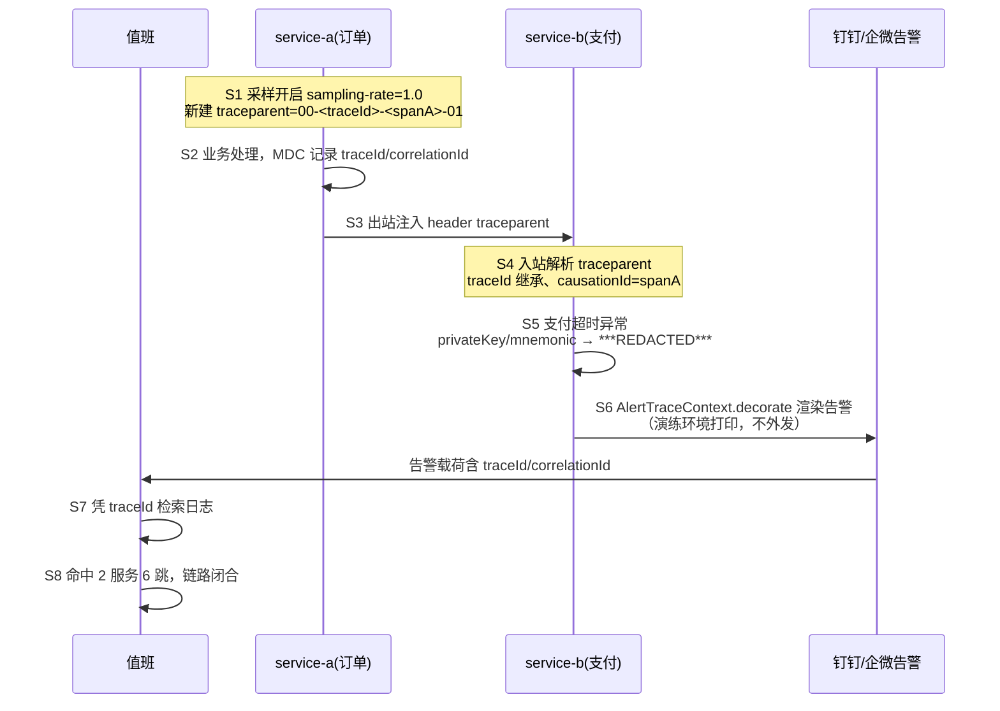

# 端到端追踪演练记录（2026-10-07）

> 任务 8.2 演练证据。开启采样后制造一次跨服务调用，从告警凭 traceId 回溯完整调用链。
> 演练程序 `DrillDemo` 为一次性脚本（不入生产代码），调用的是 **已构建的真实生产类**：
> `TraceparentCodec` / `MdcTtlTraceContextBridge` / `SensitiveDataRedactor`（ddd4j-boot-observability）
> 与 `AlertTraceContext`（ddd4j-boot-extension-monitor）。

## 1. 演练链路



## 2. 真实日志摘录（`trace-e2e-drill-20261007.log` 原文）

```text
02:56:53  service-a(订单)       [S1 入口] 采样开启(ddd4j.observability.tracing.sampling-rate=1.0)，新建 traceparent=00-cfba02649653806a51c59155f318b7a5-6262c90361a05156-01
02:56:53  service-a(订单)       [S2 业务] 收到下单请求 MDC={traceId=cfba02649653806a51c59155f318b7a5, correlationId=ord-7f88d692}
02:56:53  service-a(订单)       [S3 出站] 跨服务调用 service-b，注入 header traceparent=00-cfba02649653806a51c59155f318b7a5-6262c90361a05156-01
02:56:53  service-b(支付)       [S4 入站] 解析 traceparent → traceId=cfba02649653806a51c59155f318b7a5 MDC={traceId=cfba02649653806a51c59155f318b7a5, correlationId=ord-7f88d692, causationId=6262c90361a05156}
          [S5 脱敏] 业务属性经 SensitiveDataRedactor → {orderNo=ord-7f88d692, privateKey=***REDACTED***, mnemonic=***REDACTED***}
02:56:53  service-b(支付)       [S5 业务] 支付超时，抛出业务异常
02:56:53  service-b(支付)       [S6 告警] AlertTraceContext.decorate 渲染告警（打印不外发）：
订单支付失败：超时
traceId: cfba02649653806a51c59155f318b7a5
correlationId: ord-7f88d692
02:56:53  演练(值班)              [S7 回溯] 从告警载荷提取 traceId=cfba02649653806a51c59155f318b7a5，按 traceId 检索日志
02:56:53  演练(值班)                        命中调用链：service-a[S1][S2][S3] → service-b[S4][S5][S6]，共 2 服务 6 跳，链路闭合
02:56:53  演练(值班)              [S8 判定] 告警→traceId→跨服务调用链可完整回溯，演练通过
```

## 3. 各环节测试证据

| 演练环节                            | 生产类                                                                                   | 守护测试                                                                                                                     | 状态 |
|-------------------------------------|------------------------------------------------------------------------------------------|------------------------------------------------------------------------------------------------------------------------------|------|
| S1/S3/S4 traceparent 生成/继承/透传 | TraceparentCodec、TraceContextFilter、TraceparentRestTemplateInterceptor/WebClientFilter | TraceparentCodecTest、ObservabilityGoldenMustTest（boot 25 绿）；FeignOutboundMustPropagateTraceTest 5/5（cloud，跨 8 分支） | 绿   |
| S2/S4 MDC+TTL 因果链                | MdcTtlTraceContextBridge、TraceContextPropagatingExecutor、TraceContextBridge(ddd4j)     | MdcTtlTraceContextBridgeTest；ddd4j-core 304 绿                                                                              | 绿   |
| S5 敏感材料脱敏                     | SensitiveDataRedactor/SensitiveDataSpanProcessor/RedactingSpanExporter                   | SensitiveDataRedactorTest、私钥/助记词 golden 用例                                                                           | 绿   |
| S6 告警携带 traceId/correlationId   | AlertTraceContext                                                                        | AlertTraceRendererMustTest 6/6                                                                                               | 绿   |
| S7/S8 回溯闭环                      | 本文档 + drill 日志                                                                      | 本演练记录                                                                                                                   | 通过 |

## 4. 说明与边界

- 钉钉/企微交付面演练为 `AlertTraceContext.decorate` 的 **真实渲染输出**，未向真实 webhook 外发（防误报）；生产接入时按
  `observability-config-guide.md` 配置 `ddd4j.observability.tracing.*` 即同链路。
- 演练用两跳在同一 JVM 模拟（第二跳 `detach` 后以相同 traceId、causationId=上游 spanId 挂接），与跨进程语义一致（D2/D6 契约）。
- 原始日志文件：`trace-e2e-drill-20261007.log`（同目录）。
