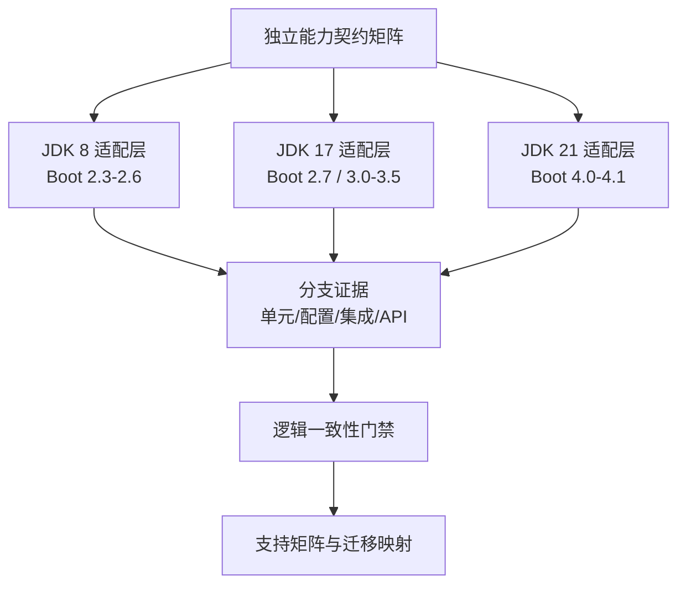

# ddd4j-boot 跨 JDK 维护线逻辑一致性设计

- 日期：2026-08-31
- 状态：待评审
- 涉及模块：`ddd4j-boot` 全部维护线、BOM、Core、Web、Data、Auth、Cache、MQ、Extensions、Samples

## 1. 目标与范围

本规格将 `ddd4j-boot` 的维护线收敛到一组独立的逻辑能力契约。每条维护线必须在其可支持的 Spring Boot/JDK 组合下提供相同的可观察行为；实现代码、包名、Jackson 坐标和自动配置注册形式可以不同。

维护线分组如下：

| JDK 组 | Boot 线 | 逻辑定位 |
|---|---|---|
| JDK 8 | `2.3.x`、`2.4.x`、`2.5.x`、`2.6.x` | Spring Boot 2 历史兼容组 |
| JDK 17 | `2.7.x`、`3.0.x`、`3.1.x`、`3.2.x`、`3.3.x`、`3.4.x`、`3.5.x` | 当前主能力收敛组 |
| JDK 21 | `4.0.x`、`4.1.x` | Spring Boot 4 前向适配组 |

本规格不要求：

- 跨 JDK 组二进制或源码兼容。
- 将 JDK 8 分支改写为 Jakarta API、记录类、虚拟线程或 Jackson 3。
- 将某个分支的文件完整复制到另一分支。
- 以版本字符串、模块存在或 Context 能启动代替行为验证。

## 2. 总体架构

能力契约是唯一逻辑事实源。每个分支实现一个适配层：JDK 8 使用 `javax` 与 Spring Boot 2 兼容机制；JDK 17 使用 Boot 2.7 或 Boot 3 的对应机制；JDK 21 使用 Boot 4 与最新 JDK API。适配层不得改变同一契约的成功结果、失败语义、默认值、回退策略和资源清理责任。

## 3. 能力契约矩阵

每条契约记录 `contract_id`、能力组、可观察行为、支持状态、分支实现位置、测试所有者、JDK 组差异和迁移说明。支持状态只能是：

- `REQUIRED`：所有维护线必须提供。
- `ADAPTED`：所有维护线必须提供等价行为，但实现随 JDK/Spring 变化。
- `NOT_APPLICABLE`：上游平台明确不支持；必须附原因和迁移说明。
- `BLOCKED`：尚无有效构件、依赖或运行环境；不能显示为已支持。

初始能力组如下：

| 能力组 | 必须保持的逻辑 |
|---|---|
| Core / SPI / Repository / CQRS | 默认装配、SPI 注册、Repository 自动注册、CommandBus 选择、上下文关闭后的对称清理 |
| Auto-configuration | 默认装配、属性禁用、缺类回退、用户 Bean 覆盖、重复上下文无残留 |
| WebMVC / WebFlux | Servlet/Reactive 条件边界、请求上下文、健康检查、异常翻译、幂等与公共路径策略 |
| Auth | Provider 选择、用户覆盖、缺依赖回退、认证失败与无认证语义 |
| Data / Cache | MyBatis/JPA 可选边界、加密、数据权限、日志、缓存注册与默认行为 |
| MQ | 总开关、broker 选择、属性绑定、客户端覆盖、发布/消费/ack 与关闭资源语义 |
| 配置 / BOM | 公开构件、逻辑配置键、默认值、禁用语义、废弃键映射与合法依赖组合 |

## 4. JDK 组适配规则

| 维度 | JDK 8 组 | JDK 17 组 | JDK 21 组 |
|---|---|---|---|
| Servlet 命名空间 | `javax.*` | 依分支使用 `javax` 或 `jakarta` | `jakarta.*` |
| 自动配置注册 | Spring Boot 2 可识别入口 | Boot 2.7 兼容入口或 Boot 3 imports | Boot 4 imports |
| Jackson | 与 Boot 2 兼容的 Jackson 2 | Jackson 2 或分支规定的升级适配 | Boot 4/Jackson 适配层 |
| Java 语法 | Java 8 语言与字节码 | Java 17 语言与字节码 | Java 21 语言与字节码 |
| API 策略 | 组内兼容 | 组内兼容 | 组内兼容 |

跨组升级必须提供显式迁移映射，至少包含替换类型、配置键迁移、行为差异、最小验证用例。跨组不以 japicmp 的二进制兼容结果作为通过条件；同组内的公开 API 差异必须由二进制/源码报告和迁移记录共同审查。

## 5. 自动配置与生命周期约束

每个公开 starter 的自动配置必须具备唯一、可定位的入口，并覆盖以下契约：

1. 依赖和属性满足时创建默认 Bean。
2. `enabled=false` 或等价禁用状态不创建默认 Bean。
3. 缺失关键类时上下文不失败且不创建对应 Bean。
4. 用户 Bean 存在时默认实现退让。
5. 上下文关闭后 SPI、Repository、ThreadContext、缓存或连接资源按所有权对称清理。

JDK 8 线可以使用 Spring Boot 2 可识别的注册方式；JDK 17/21 线使用各自 Boot 版本要求的注册资源。注册形式不同不构成逻辑差异。

## 6. 测试策略

测试分为四层，所有通过结果必须记录分支、JDK、Spring Boot、ddd4j revision、Git SHA 和命令：

| 层级 | 验证对象 | 主要工具 |
|---|---|---|
| 契约单元测试 | 自动配置五维、错误/默认值/覆盖/关闭语义 | ApplicationContextRunner、WebApplicationContextRunner、ReactiveWebApplicationContextRunner、JDK 8 等价测试夹具 |
| 配置与BOM测试 | 配置元数据、默认值、公开构件、依赖版本组合 | Maven effective POM、metadata diff、Enforcer |
| 集成测试 | 数据、缓存、MQ broker、Web 与外部依赖 | Testcontainers 或各JDK可用的等价真实依赖测试 |
| 迁移测试 | 跨组 API、配置与行为映射 | 消费者 fixture、迁移表、行为断言 |

能力矩阵的每一行必须至少链接一个测试。JDK 8 不能运行的测试必须有同一能力的 JDK 8 等价夹具；不能以 `@Disabled` 或 skipped 结果关闭契约。

## 7. 分阶段收敛

1. **基线审计**：建立机器可读的能力、模块、配置、API、测试和支持状态清单；禁止先改业务代码。
2. **JDK 8 组**：以 `2.3.x`、`2.4.x`、`2.5.x`、`2.6.x` 的 Boot 2 差异实现共同契约，保留 Java 8。
3. **JDK 17 组**：先校验 `2.7.x` 到 `3.5.x` 的逻辑连续性，再处理 Boot 2.7 与 Boot 3 的注册/Jakarta 差异。
4. **JDK 21 组**：以 `4.0.x`、`4.1.x` 完成 Boot 4 与 JDK 21 等价能力映射。
5. **发布门禁**：将逻辑矩阵接入候选仓库、外部消费者、SBOM、漏洞、性能、可观测性、金丝雀和回滚证据。

每一阶段先以失败测试证明缺口，再写最小适配；不得以跨分支复制或大范围重构代替契约收敛。

## 8. 风险与缓解

| 风险 | 缓解 |
|---|---|
| 把 JDK 差异误判为逻辑差异 | 以可观察输入/输出、默认值与资源生命周期定义契约，不比较源文件文本 |
| 远端分支再次漂移 | 每次执行矩阵前验证 GitHub/Codeup SHA 与 POM revision；同步使用精确 lease |
| 旧线缺少测试或构件 | 标记 `BLOCKED`，先补最小夹具或恢复构件，禁止假设兼容 |
| Jackson/Jakarta 改造扩大范围 | 在迁移映射中隔离坐标与包名差异，仅测试对外序列化/错误语义 |
| MQ/容器测试在旧JDK不可运行 | 用该JDK可执行的等价容器版本或专用 profile；不接受 skipped 作为通过 |

## 9. 交付物

- 机器可读的跨分支能力契约矩阵与支持状态。
- 每个能力组的分支实现映射和测试映射。
- JDK 8、17、21 的配置/API/Jackson/Jakarta 迁移表。
- 同组 API 与配置差异报告。
- 逻辑一致性汇总报告，明确 `PASS`、`BLOCKED` 与 `NOT_APPLICABLE`。
- 更新后的 ddd4j-cloud 版本组合输入，禁止以错误的 JDK 线参与兼容矩阵。

## 10. 未决事项

1. `2.3.x` 的 revision 仍为双 `.x` 形式；这是版本元数据修复项，不改变其 JDK 8 逻辑定位。
2. `4.0.x`、`4.1.x` 当前 POM 是否需要显式声明 ddd4j 3.0.x，而非仅经父/BOM获得，需在基线审计中以有效依赖树决定。
3. 各历史线的公开构件是否都可从候选仓库解析，需作为发布门禁单独验证。
