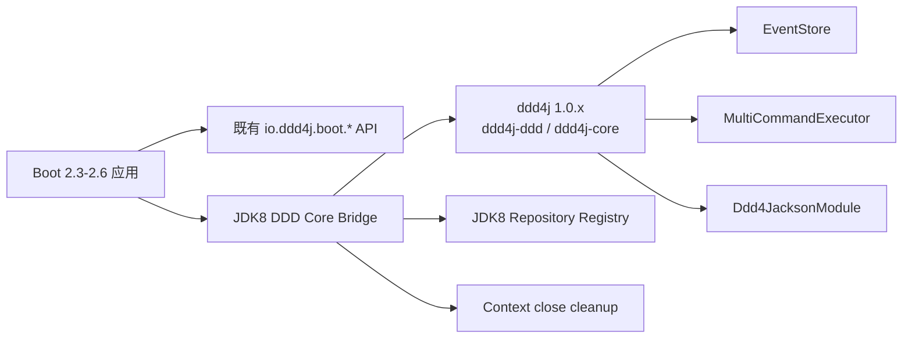

# ddd4j-boot JDK 8 Core Bridge 设计

- 日期：2026-08-31
- 状态：已确认，待执行
- 适用分支：`2.3.x`、`2.4.x`、`2.5.x`、`2.6.x`
- 上游基线：`ddd4j feature/1.0.x`，revision `1.0.x.20260630-SNAPSHOT`，Java 8

## 1. 目标

为 JDK 8 / Spring Boot 2 维护线提供与 JDK 17 主能力组逻辑等价的 DDD 核心桥接，同时保留既有 `io.ddd4j.boot.*` 的公开 API、模块坐标和历史 starter。桥接的可观察行为为：默认 DDD 基础设施装配、显式禁用、缺类回退、用户 Bean 覆盖、重复 ApplicationContext 关闭后的资源清理。

本设计不将 JDK 8 线改写为 Boot 3/Jakarta，不复制 3.4.x 源码，也不删除 `ddd4j-boot-cmpt` 历史组件。

## 2. 事实基线

`2.3.x`–`2.6.x` 的 `ddd4j-boot-core` 与 `ddd4j-boot-cmpt` 是历史 API 和 starter 集合；它们缺少当前的 `Ddd4jCoreAutoConfiguration`、`Ddd4jRepositoryAutoConfiguration` 及其 SPI 生命周期桥接。

`ddd4j feature/1.0.x` 是 Java 8 基线，包含：

- `io.ddd4j:ddd4j-ddd`：`DddAutoConfiguration`、`Ddd4JacksonModule`、`MultiCommandExecutor`、`EventStore` 的上游 DDD/CQRS 能力。
- `io.ddd4j:ddd4j-core`：`BaseRepository`、领域事件和兼容的基础类型。
- Spring Framework 5.3、Jackson 2、`javax.*` 兼容面。

## 3. 目标架构

桥接仅负责 Spring Boot 条件装配、用户覆盖和生命周期；领域模型、事件存储和命令路由仍由 `ddd4j 1.0.x` / fuin 依赖提供。

## 4. 组件与接口

### 4.1 依赖管理

每条 JDK 8 分支在 `ddd4j-boot-dependencies/pom.xml` 增加 `ddd4j.version=1.0.x.20260630-SNAPSHOT`，并管理 `io.ddd4j:ddd4j-ddd` 与 `io.ddd4j:ddd4j-core`。`ddd4j-boot-core/pom.xml` 仅依赖这些公开构件，不嵌入上游源码。

`ddd4j feature/1.0.x` 保持既有 `com.github.hiwepy:mybatis-plus-enhance` 单体 ABI，并将其 dependency-management revision 对齐为 `2.7.x.20260630-SNAPSHOT`。不得把模块化 `io.github.easy4j:mybatis-plus-enhance-core` / `extension` / `spring` 构件以旧单体坐标安装或发布。

候选仓库无法解析这些精确构件时，构建或发布报告必须标为 `BLOCKED`；本地安装只用于验证，不构成发布证据。

### 4.2 Boot 2 核心桥接

新增 `io.ddd4j.boot.core.ddd.Ddd4jJdk8CoreAutoConfiguration`，使用 Boot 2 的 `spring.factories` 注册，并满足：

1. 类路径具备 `AggregateRoot`、`EventStore`、`Command` 时，且 `ddd4j.ddd.enabled` 未设为 `false`，创建默认 `EventStore`、`Ddd4JacksonModule`、`MultiCommandExecutor`。
2. 每个默认 Bean 使用 `@ConditionalOnMissingBean`；应用自定义 EventStore、模块或命令总线时不覆盖。
3. 缺少关键类时不创建 Bean 且上下文可启动。
4. 默认内存 EventStore 在销毁阶段关闭；用户提供的 EventStore 不由桥接关闭。
5. 命令总线只读取 Spring 已注册的 `CommandExecutor`，不复制领域命令实现。

### 4.3 Repository 桥接

新增 `Ddd4jJdk8RepositoryAutoConfiguration` 和包内 `Ddd4jJdk8RepositoryRegistry`。Registry 仅登记实现 `io.ddd4j.core.contract.BaseRepository` 或带 `io.ddd4j.annotation.DomainRepository` 的 Spring Bean，并提供只读快照查询；重复键 fail-fast，context 关闭清空内部索引。

既有 `io.ddd4j.boot.core.annotation.DomainRepository` 保持可用，但不会被静默替换或删除。跨注解兼容通过显式适配检测实现。

## 5. 配置与兼容规则

| 键 | 默认 | 语义 |
|---|---:|---|
| `ddd4j.ddd.enabled` | `true` | `false` 时桥接不创建默认 DDD Bean |
| `ddd4j.ddd.eventstore.type` | `mem` | 仅决定桥接默认 EventStore；自定义 EventStore 优先 |

JDK 8 组内不得删除或改义既有公开配置键。新增键的默认值不能改变历史 starter 的默认行为；只有应用显式启用 DDD bridge 或 classpath 存在 ddd4j 1.0 能力时才激活。

## 6. 测试与验收

每条 JDK 8 维护线在其实际 Boot 2 版本下提供 `ApplicationContextRunner` 或等价夹具，至少验证：

- 默认装配和命令执行器收集；
- `ddd4j.ddd.enabled=false`；
- `FilteredClassLoader` 缺类回退；
- 用户 EventStore / Jackson Module / CommandBus 覆盖；
- context close 后默认 EventStore 与 Repository Registry 的对称清理；
- 历史 `io.ddd4j.boot.*` core 与一个代表性 `cmpt` starter 仍可编译和启动。

先运行失败测试，再写最小实现。编译、单元测试和候选仓库干净缓存解析分别记录，不能互相替代。

## 7. 分阶段交付

1. 先在 `ddd4j feature/1.0.x` 对齐旧单体 ABI 依赖并在 Java 8 下安装真实上游构件。
2. 在 `2.3.x` 以 Java 8 引入依赖管理、核心桥接、Registry 与失败测试，完成本地 Maven 验证。
3. 将行为差异而非文件文本移植到 `2.4.x`–`2.6.x`，逐线运行其 Boot 版本的测试。
4. 更新跨分支证据表、同组 API/配置比较和候选仓库解析证据。
5. 在 JDK 8 组通过后，继续 JDK 17 / JDK 21 分支与 ddd4j-cloud 的版本组合收敛。

## 8. 风险与非目标

- `ddd4j 1.0.x` 或 `mybatis-plus-enhance` SNAPSHOT 未发布时，候选发布保持 `BLOCKED`。
- 不将 JDK 8 分支升级为 Java 17、Jackson 3 或 Jakarta。
- 不承诺 JDK 8 与 JDK 17 的二进制兼容；跨组由迁移映射保证逻辑等价。
- 不在本变更中重构所有历史 `cmpt` starter；后续按能力契约逐项收敛。
