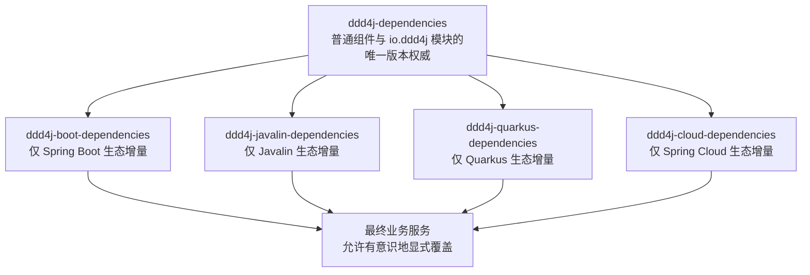

# Maven Model 4.1 与平台依赖权威治理规格

状态：架构边界已批准，书面规格待审阅，未实施。

## 背景

`ddd4j-boot` 的 `4.0.x`、`4.1.x` 使用 Maven Model 4.1 和 JDK 21。当前聚焦 reactor
可以编译，但 Maven 4 在构建有效模型时报告约 18 万项问题。其中大量问题是同一组父引用告警和
BOM 冲突在 73 个 reactor 模块中重复展开，不能据此认定存在 18 万个独立缺陷，也不能因为编译
成功而忽略最终版本的不确定性。

本次治理必须保持 ddd4j 的平台定位：`ddd4j-dependencies` 是自有体系内普通组件与 ddd4j 模块的
唯一版本权威。生态 BOM 只增加所在生态位的依赖，不得演变成第二套普通组件版本中心。

## 目标

1. 使 `ddd4j-boot` 4.0/4.1 的全部父引用符合 Maven Model 4.1。
2. 建立可执行的依赖归属规则，阻止普通组件版本散落到 Boot、Javalin、Quarkus、Cloud 生态 BOM。
3. 保持 `ddd4j-dependencies` 对普通组件版本的源头控制，使上游修复版本能被所有生态下游继承。
4. 清理 `ddd4j-boot-dependencies` 中越界的普通组件显式版本与直接管理项。
5. 用有效模型证明关键依赖的最终版本和来源，而不是依赖 BOM 导入顺序推断。

## 架构边界

### `ddd4j-dependencies`

必须管理：

- `io.ddd4j:*` 全部模块；
- Jackson、SLF4J、Logback、Netty、Hibernate、Micrometer、JAXB、数据库驱动、MQ 客户端等普通组件；
- 多个生态共同消费的工具库、协议库和基础扩展；
- Boot/Javalin/Quarkus/Cloud 未覆盖但属于平台公共基线的依赖。

不得为了消除 Maven 告警而删除这些公共版本的源头治理。需要减少重复 BOM 导入时，必须确保同等
版本约束仍由 `ddd4j-dependencies` 直接或间接提供，并由测试证明。

### 生态依赖 BOM

- `ddd4j-boot-dependencies`：Spring Boot BOM、Boot Starter、Boot 自动配置和 Boot 专属集成。
- `ddd4j-javalin-dependencies`：Javalin 核心及 Javalin 专属扩展。
- `ddd4j-quarkus-dependencies`：Quarkus BOM 与 Quarkus Extension。
- `ddd4j-cloud-dependencies`：Spring Cloud、Spring Cloud Alibaba 和云服务治理组件。

生态 BOM 可以导入官方生态 BOM。官方 BOM 隐式携带的普通组件不视为生态层主动维护，但生态层
不得再为这些普通组件创建独立版本属性或直接管理项。发生版本冲突时，最终普通组件版本必须符合
`ddd4j-dependencies` 的平台基线。

### 最终业务服务

业务服务可以因明确业务需要显式覆盖版本，但必须承担偏离平台基线的兼容验证责任。业务覆盖不应
反向污染平台 BOM，也不纳入生态 BOM 的禁止规则。

## 阶段一：Maven Model 4.1 父引用

### 规则

1. 外部父 POM：保留 `groupId/artifactId/version`，不声明 `relativePath`。
2. reactor 内部父 POM：只保留 `relativePath`，不同时声明父坐标。
3. `relativePath` 必须指向真实父 POM；目录形式和 `pom.xml` 形式统一为可解析的明确路径。
4. 4.x 聚合仍使用 `<subprojects>`，不得退回 `<modules>`。

### 可观察验收

- 4.0、4.1 所有实际 `pom.xml` 都通过结构检查。
- Maven 4 输出中的 `parent.relativePath` 告警从当前 72 条降为 0。
- 根、BOM、dependencies、parent、license 聚焦 reactor 均能解析和编译。
- 不改变任何制品坐标、版本号和模块集合。

## 阶段二：依赖归属和版本权威

### 归属清单

建立机器可读的坐标归属规则，至少区分：

- `platform`：只允许在 `ddd4j-dependencies` 主动管理；
- `spring-boot`：允许在 `ddd4j-boot-dependencies` 管理；
- `javalin`、`quarkus`、`spring-cloud`：预留给对应生态 BOM；
- `business-override`：仅用于最终业务服务，不进入框架 BOM。

检查器必须分析版本属性、直接 dependencyManagement 项和 BOM import。不能只按 groupId 粗略判断；
同一组织可能同时包含普通组件和生态专属 Starter，归属清单必须允许坐标级例外。

### Boot 层清理

1. 盘点 `ddd4j-boot-dependencies` 中全部显式版本属性和直接管理项。
2. 普通组件已有上游管理时，删除 Boot 层重复声明。
3. 普通组件上游缺失时，先补入 `ddd4j-dependencies`，验证发布/本地消费后再删除 Boot 层声明。
4. 保留 Spring Boot 官方 BOM、Boot Starter 和 Boot 专属扩展。
5. 有意覆盖必须落在 `ddd4j-dependencies`，附原因和回归证据，不得留在 Boot 层。

### 关键版本契约

有效模型检查至少覆盖：

- Jackson；
- SLF4J 与 Logback；
- Hibernate；
- Micrometer；
- ActiveMQ；
- JAXB；
- Netty；
- 数据库驱动。

每项契约必须同时断言期望版本和归属来源。仅断言“存在版本”或构建成功不算通过。

### 告警治理

- 下游显式重复管理导致的告警必须消除。
- BOM 隐式交集必须统计并建立基线，确认最终版本由平台层控制。
- 不允许通过交换 BOM 顺序、关闭告警或批量添加下游覆盖来刷绿。
- 如果 Maven 4 对已确定且无法消除的官方 BOM 交集继续告警，必须进入精确白名单；白名单包含坐标、
  两侧版本、最终版本、权威来源和保留原因。
- 新增未登记冲突必须使验证失败。

## 测试策略

### RED

1. Model 4.1 结构测试在当前父引用写法下失败，并报告具体 POM。
2. 依赖归属测试在 Boot 层发现普通组件显式版本时失败。
3. 有效模型测试在关键组件版本与 `ddd4j-dependencies` 不一致时失败。

### GREEN

1. 修改父引用后结构测试和 Maven 4 聚焦模型通过。
2. 将越界管理迁回平台层后归属测试通过。
3. 4.0、4.1 分别生成有效模型，关键组件版本与平台基线一致。

### 回归

- `scripts/consistency/test-maintenance-build-matrix.sh`；
- 依赖 BOM 边界测试；
- 4.0、4.1 license 聚焦测试；
- 受依赖调整影响的 Boot Starter 聚焦测试；
- 条件允许时执行 4.x 完整 reactor；否则明确记录阻塞模块，不以聚焦测试替代整仓结论。

## 分支与发布策略

1. 先在 `ddd4j-boot` `4.1.x` 建立测试和实现，再传播到 `4.0.x`。
2. 平台依赖缺口必须在 `ddd4j` `feature/3.0.x` 修复；该分支当前被既有 worktree 占用，在用户从
   外部释放前不得绕过占用、使用或删除该 worktree。
3. 每个仓库、每条分支独立提交并验证。
4. commit、push、Maven deploy、空缓存消费和 Actions 是独立证据层。
5. 本规格不授权 Maven deploy；push 沿用当前用户授权，但必须先处理远端并行提交且禁止 force push。

## 非目标

- 不削弱 `ddd4j-dependencies` 对普通组件的统一治理。
- 不把 Spring Boot BOM 提升为全平台版本权威。
- 不在本阶段修改 Javalin、Quarkus、Cloud 仓库；只保证归属规则可扩展。
- 不允许生态 BOM 为追求局部构建成功复制普通组件版本。
- 不修改业务服务的显式版本覆盖。
- 不使用 Git worktree，不移除现有 worktree，不重写已推送历史。

## 完成定义

- Model 4.1 父引用结构规则在 4.0/4.1 全部通过，相关告警为 0。
- Boot 依赖归属检查通过，普通组件主动管理集中在 `ddd4j-dependencies`。
- 关键版本的最终值和权威来源均有自动化断言。
- 4.0/4.1 聚焦构建通过，并记录完整 reactor 的真实结果。
- 本地、跟踪分支和 GitHub SHA 完成对账；发布与空缓存消费状态单独报告。
